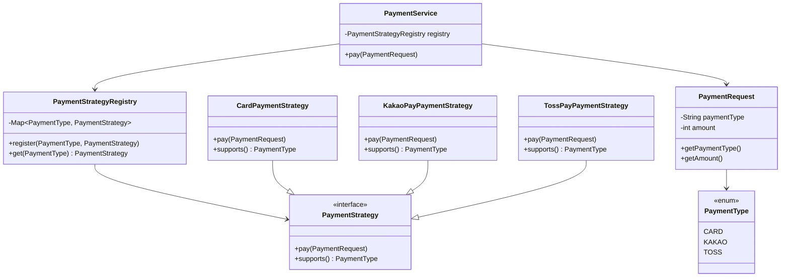

# HeadFirstDesignPattern

## 전략패턴

변경되는 알고리즘(전략)을 인터페이스로 분리하고,  
실행 시점에 원하는 알고리즘을 선택·교체할 수 있게 하는 패턴

### 코드 구현에 활용된 예시: 결제 모듈

- 사용자에게 입력된 `request`의 결제 수단(paymentType)에 따라  
  서로 다른 결제 로직(카드 결제, 계좌 이체 등)을 실행해야 하는 상황
- 결제 방식마다 처리 로직은 다르지만,  
  **“결제한다(pay)”라는 행위의 목적은 동일**
- 조건문(`if / switch`)으로 분기하지 않고,  
  결제 알고리즘을 `PaymentStrategy` 인터페이스로 추상화
- 실행 시점에 적절한 전략 구현체를 선택하여 주입함으로써  
  결제 방식 추가 시 기존 코드 수정 없이 확장 가능

→ **결제 로직의 변경을 전략 객체로 캡슐화하여, 컨텍스트(결제 서비스)는 변경에 영향을 받지 않도록 설계**

---

### 클래스 구조 및 실행 흐름

#### 클래스 다이어그램

#### 실행 흐름

